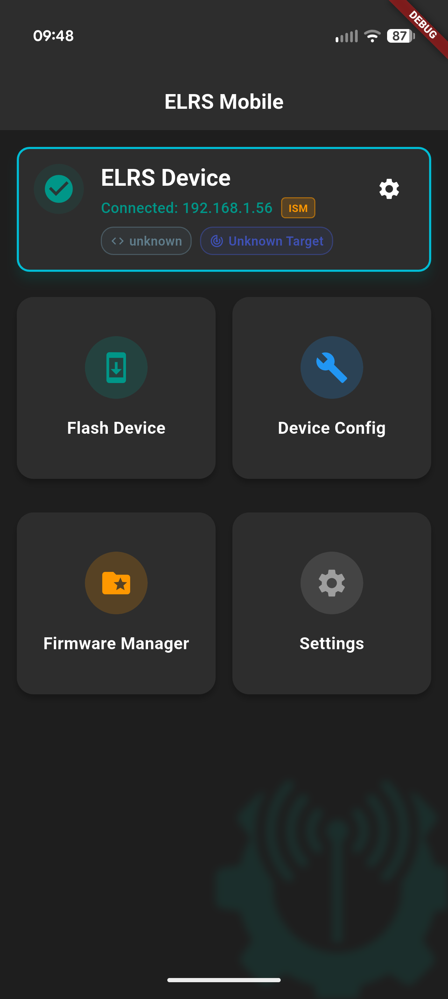
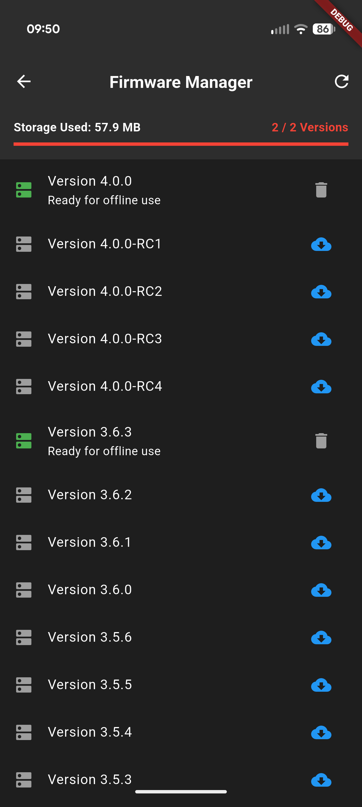
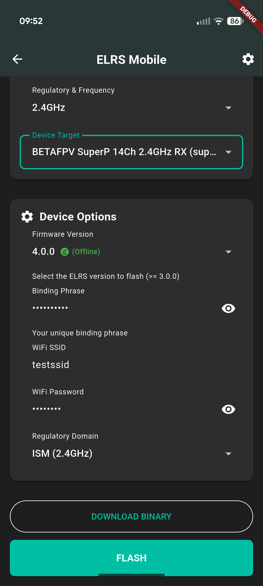
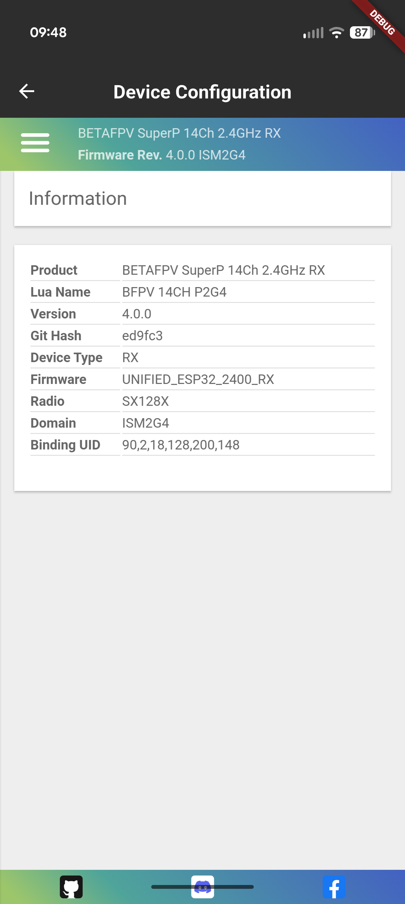

  

# ExpressLRS Mobile

ExpressLRS Mobile is a modern, cross-platform companion application built with Flutter, designed to simplify the management, configuration, and flashing of ExpressLRS hardware directly from your mobile device or desktop.

Whether you are configuring a new receiver on the bench or flashing an emergency update in the middle of a field with no cellular service, ELRS Mobile provides a seamless, robust Over-The-Air (OTA) experience.

*Note: This is an independent, community-driven tool and is not officially affiliated with, sponsored by, or endorsed by ExpressLRS LLC. Compatible with ExpressLRS 3.x and 4.x firmware.*

🚀 **Quick Start**

- **Download:** Grab the latest `.apk` from the [Releases Page](https://github.com/wbhinton/ELRS-Mobile/releases).
- **Install:** Open the file on your Android device. You may need to "Allow from this source" in your browser settings.
- **Connect:** Power on your ELRS hardware, join its Wi-Fi hotspot, and open the app. It will auto-detect your device via mDNS.

**Key Features**
- 100% Offline Flashing: Prepare for the field using the Firmware Manager. The app caches complete firmware releases (firmware.zip and hardware.zip directly from Artifactory), allowing you to dynamically assemble and flash firmware targets without an internet connection.
- Mobile-First Workflow: No USB cables, no Python environments, no driver issues. Connect to your receiver or transmitter's Wi-Fi hotspot and flash directly from your phone.
- Device Configurator & Native WebUI: Automatically discover devices on your network via mDNS. View live hardware status, configure PWM pins, adjust Model Match, or instantly access the device's native ELRS WebUI through the app's embedded WebView.
- Smart Hardware Resolution: Features an intuitive cascading selection system (Device Type ➔ Vendor ➔ Frequency ➔ Target) ensuring you always build the correct payload for your hardware.

> [!TIP]
> **Pro-Tip:** ELRS Mobile natively handles forced routing, ensuring your phone doesn't silently switch back to 5G/LTE when it realizes the ELRS hotspot has no internet. This completely eliminates the most common "connected but can't see the receiver" issue out in the field.

--------------------------------------------------------------------------------
**Screenshots**

  
  
  

  
  
  

--------------------------------------------------------------------------------
**Documentation**

For detailed instructions and technical information, please refer to the documentation:

- **[Installation Procedures](docs/installation.md)**: How to download and install the app.
- **[Usage Instructions](docs/usage_instructions.md)**: Step-by-step guide on caching firmware, connecting to your device, and flashing.
- **[Supported Hardware](docs/supported_hardware.md)**: Lists of explicitly tested hardware targets and binaries, and supported platforms.
- **[Technical Architecture](docs/technical_architecture.md)**: Details on the native Dart implementation and unified firmware assembly.
- **[Development & Auditing](docs/development.md)**: Information for developers regarding firmware auditing and byte-perfect matches.

--------------------------------------------------------------------------------
## 💬 Community & Support
- **Discord:** Join the [ExpressLRS Discord](https://discord.gg/expresslrs) and find me in the `#testing` channel.
- **Bug Reports:** Please use the [GitHub Issue Tracker](https://github.com/wbhinton/ELRS-Mobile/issues) for technical bugs.
- **Feedback:** Feel free to open a [Discussion](https://github.com/wbhinton/ELRS-Mobile/discussions) for feature requests!

--------------------------------------------------------------------------------
*License & Attribution*
- Software License: This project is licensed under the GPLv3.
- Trademark Notice: "ExpressLRS" is a trademark of ExpressLRS LLC.
- Credits: Massive thanks to the ExpressLRS development team. The open-source nature of their Configurator, Web Flasher, and WebUI made reverse-engineering this native Flutter implementation possible.